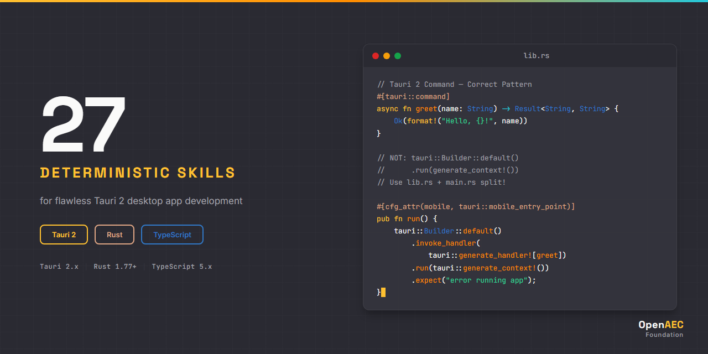

# Tauri 2 Claude Skill Package

<p align="center">
  
</p>


**27 deterministic Claude AI skills for Tauri 2 desktop application development — Rust + TypeScript full-stack coverage.**

Built on the [Agent Skills](https://agentskills.org) open standard.

---

## Why This Exists

Without skills, Claude generates outdated Tauri 1.x patterns:

```rust
// Wrong — Tauri 1.x pattern that fails in v2
tauri::Builder::default()
    .invoke_handler(tauri::generate_handler![greet])
    .run(tauri::generate_context!())
    .expect("error");
```

With this skill package, Claude produces correct Tauri 2 code:

```rust
// Correct — Tauri 2 with proper lib.rs + main.rs split
#[cfg_attr(mobile, tauri::mobile_entry_point)]
pub fn run() {
    tauri::Builder::default()
        .plugin(tauri_plugin_opener::init())
        .invoke_handler(tauri::generate_handler![greet])
        .run(tauri::generate_context!())
        .expect("error while running tauri application");
}
```

---

## Skill Packages

| Category | Count | Purpose |
|----------|:-----:|---------|
| **tauri-core/** | 3 | Architecture, configuration, runtime lifecycle |
| **tauri-syntax/** | 8 | Commands, events, state, permissions, plugins, windows, webviews, menus |
| **tauri-impl/** | 10 | Project setup, build/deploy, mobile, testing, security, migration, database, design patterns, multi-window, plugin development |
| **tauri-errors/** | 4 | Build errors, IPC errors, permission errors, runtime errors |
| **tauri-agents/** | 2 | Project scaffolder, code review checklist |
| **Total** | **27** | |

## Skill Categories

| Category | Description |
|----------|-------------|
| `syntax/` | API syntax, code patterns, IPC bridge, type signatures |
| `impl/` | Step-by-step development workflows and integration guides |
| `errors/` | Error diagnosis, debugging patterns, anti-patterns |
| `core/` | Cross-cutting architecture, configuration, lifecycle |
| `agents/` | Intelligent orchestration for scaffolding and review |

See [INDEX.md](INDEX.md) for the complete skill catalog with descriptions and trigger scenarios.

## Tech Coverage

| Area | Skills | Topics |
|------|:------:|--------|
| **Commands & IPC** | 3 | `#[tauri::command]`, `invoke()`, argument types, return types, error handling, Channel streaming |
| **Events** | 1 | Event system, emit/listen/once, global vs window-scoped, payloads |
| **Plugins** | 2 | Official plugin APIs (fs, dialog, http, etc.), custom plugin development |
| **Window & Webview** | 3 | Window management, multi-window, webview API, multi-webview |
| **State** | 1 | Managed state, `Mutex`/`RwLock`, `AppHandle.state()` |
| **Permissions & Security** | 3 | Capabilities, ACL, CSP, isolation pattern, scope control |
| **Mobile** | 1 | Android/iOS targets, platform-specific code, mobile entry points |
| **Build & Deploy** | 2 | Bundlers, code signing, auto-updater, CI/CD, sidecar binaries |
| **Architecture** | 2 | Project structure, design patterns, IPC decision trees |
| **Migration** | 1 | Tauri 1.x to 2.x migration guide |
| **Testing** | 1 | Rust unit tests, `mockIPC`, WebDriver E2E |
| **Database** | 1 | SQLite, `tauri-plugin-store`, sqlx/diesel integration |
| **Error Debugging** | 4 | Build, IPC, permissions, runtime error diagnosis |

## Installation

### Claude Code

```bash
# Option 1: Clone the full package
git clone https://github.com/OpenAEC-Foundation/Tauri-2-Claude-Skill-Package.git
cp -r Tauri-2-Claude-Skill-Package/skills/source/ ~/.claude/skills/tauri/

# Option 2: Add as git submodule
git submodule add https://github.com/OpenAEC-Foundation/Tauri-2-Claude-Skill-Package.git .claude/skills/tauri
```

### Claude.ai (Web)

Upload individual SKILL.md files as project knowledge.

## Quick Start

After installation, skills activate automatically based on context:

- **Start a new project** — ask Claude to create a Tauri 2 app → activates `tauri-impl-project-setup` + `tauri-agents-project-scaffolder`
- **Write a command** — write a `#[tauri::command]` → activates `tauri-syntax-commands`
- **Debug a build error** — paste a build error → activates `tauri-errors-build`
- **Configure permissions** — set up capabilities → activates `tauri-syntax-permissions`
- **Code review** — ask for a Tauri project review → activates `tauri-agents-review`

## Version Compatibility

| Technology | Versions | Notes |
|------------|----------|-------|
| Tauri | **2.x** | Primary target (v2.0+) |
| Rust | 1.77.2+ | Minimum Rust version for Tauri 2 |
| TypeScript | 5.x | Frontend type safety |
| Node.js | 18+ | Build tooling |

## Methodology

This package was developed using the **7-phase research-first methodology**, proven across multiple skill packages:

1. **Setup + Raw Masterplan** — Project structure and governance files
2. **Deep Research** — Comprehensive source analysis of Tauri 2 documentation, source code, and community resources
3. **Masterplan Refinement** — Skill inventory refinement based on research findings
4. **Topic-Specific Research** — Deep-dive per skill topic
5. **Skill Creation** — Deterministic skill files following Agent Skills standard
6. **Validation** — Correctness, completeness, and consistency checks (27/27 pass, 0 blockers)
7. **Publication** — GitHub release and documentation

## Documentation

| Document | Purpose |
|----------|---------|
| [INDEX.md](INDEX.md) | Complete skill catalog with trigger scenarios |
| [ROADMAP.md](ROADMAP.md) | Project status (single source of truth) |
| [REQUIREMENTS.md](REQUIREMENTS.md) | Quality guarantees and per-area requirements |
| [DECISIONS.md](DECISIONS.md) | Architectural decisions with rationale |
| [SOURCES.md](SOURCES.md) | Official reference URLs and verification rules |
| [WAY_OF_WORK.md](WAY_OF_WORK.md) | 7-phase development methodology |
| [LESSONS.md](LESSONS.md) | Lessons learned during development |
| [CHANGELOG.md](CHANGELOG.md) | Version history |
| [CONTRIBUTING.md](CONTRIBUTING.md) | How to contribute |

## Related Skill Packages

| Package | Skills | Technology |
|---------|:------:|------------|
| [Blender-Bonsai](https://github.com/OpenAEC-Foundation/Blender-Bonsai-ifcOpenshell-Sverchok-Claude-Skill-Package) | 73 | Blender, Bonsai, IfcOpenShell, Sverchok |
| [ERPNext](https://github.com/OpenAEC-Foundation/ERPNext_Anthropic_Claude_Development_Skill_Package) | 28 | ERPNext / Frappe |
| [Nextcloud](https://github.com/OpenAEC-Foundation/Nextcloud-Claude-Skill-Package) | 24 | Nextcloud |
| [React](https://github.com/OpenAEC-Foundation/React-Claude-Skill-Package) | 24 | React |
| [Vite](https://github.com/OpenAEC-Foundation/Vite-Claude-Skill-Package) | 22 | Vite |
| [n8n](https://github.com/OpenAEC-Foundation/n8n-Claude-Skill-Package) | 21 | n8n workflow automation |
| [pdf-lib](https://github.com/OpenAEC-Foundation/pdf-lib-Claude-Skill-Package) | 17 | pdf-lib |
| [Fluent-i18n](https://github.com/OpenAEC-Foundation/Fluent-i18n-Claude-Skill-Package) | 16 | Project Fluent i18n |
| [PDFjs](https://github.com/OpenAEC-Foundation/PDFjs-Claude-Skill-Package) | 13 | pdfjs-dist |

All packages at [OpenAEC Foundation](https://github.com/OpenAEC-Foundation).

## License

[MIT](LICENSE)

---

Part of the [OpenAEC Foundation](https://github.com/OpenAEC-Foundation) ecosystem.
